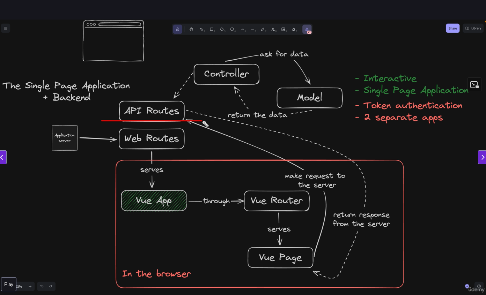
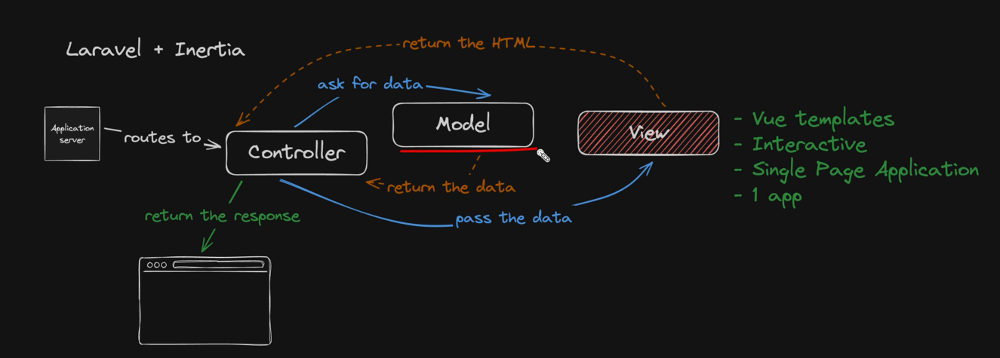

# APP structure
## Laravel + VUE

- Backend: laravel
- Frontend: vue3

## Laravel + Inertia

We are dealing with an SPA application, but we are going to handle it as a traditional laravel application.
